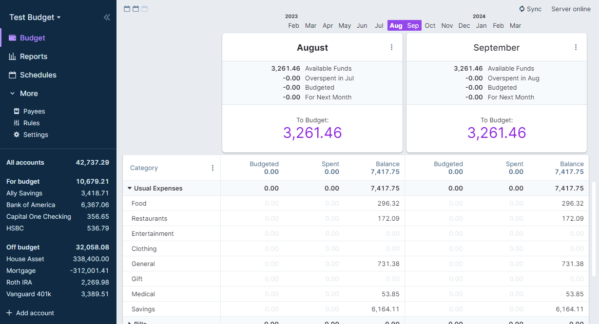
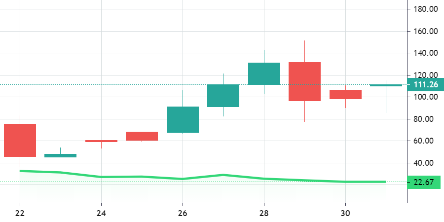
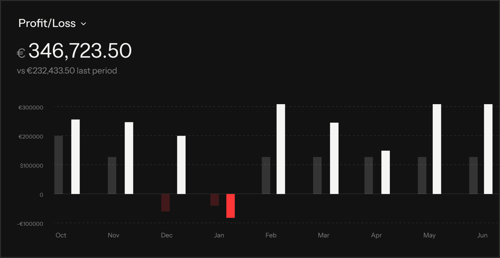

# Banxa Login - Crypto Payments And Account Access Guide

<p align="center">
  
</p>

Banxa Login brings account-access guidance, crypto payment references, wallet workflows, transaction utilities, and market-data examples into one docs-first repository. The Banxa app material is organized for readers who want to understand the sign-in path, review payment stages, buy crypto, connect a wallet, or inspect the TypeScript modules behind banking and exchange integrations.

[Overview](#overview) · [Access Matrix](#access-matrix) · [Get The Repository](#get-the-repository) · [Usage](#usage) · [Documentation Map](#documentation-map) · [FAQ](#frequently-asked-questions)

<details>
<summary><strong>Repository Contents</strong></summary>

- Account and Banxa login guidance.
- Banxa crypto purchase flow references.
- Banking, exchange, currency, and transaction TypeScript modules.
- Local documentation for OAuth, payments, imports, charts, and troubleshooting.
- Dashboard, portfolio, and market-chart examples.

</details>

## Overview

The repository follows a modular finance-documentation layout: start with the Banxa login path, choose an account or payment scenario, follow the matching local guide, and then inspect the related source module. This structure combines account management, payment routing, portfolio tracking, transaction handling, and financial charting without forcing every reader through the same setup path.



### Core Capabilities

- **Account Access:** Follow the Banxa login sequence, review account settings, and use the troubleshooting checklist when a session cannot continue.
- **Crypto Payments:** Map a buy crypto request from currency selection through payment confirmation and wallet delivery.
- **Wallet Workflows:** Prepare MetaMask or Phantom as the destination for supported assets such as USDT and Solana.
- **Transaction Records:** Import, export, filter, split, merge, tag, and transfer financial records with the included guides.
- **Market Views:** Use the chart references and TypeScript chart API to present price and transaction data.
- **Integration Patterns:** Review OAuth scopes, API endpoints, banking interfaces, exchange configuration, and safety utilities.

## Access Matrix

Use this matrix as the first routing step before opening a detailed guide.

| Goal | Starting Point | Account State | Local Reference |
|---|---|---|---|
| Open the Banxa app | Account entry | Existing account | [Account settings](docs/account-settings.mdx) |
| Complete Banxa login | Session access | Existing account | [Troubleshooting](docs/troubleshooting.mdx) |
| Buy crypto | Payment selection | Signed-in account | [Online payments](docs/accept-online-payments.mdx) |
| Review available banking paths | Bank connection | Signed-in account | [Supported banks](docs/supported-banks.mdx) |
| Connect a bank account | Banking authorization | Signed-in account | [Connect a bank](docs/connect-bank-account.mdx) |
| Work with several currencies | Currency configuration | Active workspace | [Multi-currency](docs/multi-currency.mdx) |
| Integrate an application | OAuth authorization | Developer access | [OAuth endpoints](docs/oauth-api-endpoints.mdx) |
| Inspect market movement | Chart workspace | Local repository | [Chart introduction](docs/charts-intro.mdx) |

### Payment And Wallet Matrix

| Route | Typical Use | Wallet Or Destination | Repository Area |
|---|---|---|---|
| Banxa crypto | Fiat-to-crypto access | MetaMask, Phantom, or an address | `docs/` payment guides |
| MoonPay comparison | Alternate on-ramp review | Wallet address | Access and payment matrices |
| Transak comparison | Regional payment review | Wallet address | Banking and currency guides |
| Ramp comparison | Checkout-flow review | Wallet address | OAuth and online-payment guides |
| USDT flow | Stable-value transfer | Compatible wallet network | Transaction and exchange modules |
| Solana flow | Network asset transfer | Phantom or compatible address | Market and currency modules |

## Scenario Lookup

Use this index to route Banxa login, Banxa app, Banxa crypto, and buy crypto questions to a concrete local resource.

| Search Phrase | Repository Intent | Recommended Route |
|---|---|---|
| Banxa login | Diagnose a Banxa login stage | [Troubleshooting](docs/troubleshooting.mdx) |
| Banxa app | Open a Banxa app workflow | [Apps overview](docs/apps-overview.mdx) |
| Banxa crypto | Trace a Banxa crypto transaction | [Transfers](docs/transfers.md) |
| Banxa buy crypto | Follow a Banxa buy crypto sequence | [Online payments](docs/accept-online-payments.mdx) |
| Buy crypto | Compare a buy crypto payment path | [Multi-currency](docs/multi-currency.mdx) |
| What is Banxa | Answer what is Banxa through repository scope | [Introduction](docs/introduction.mdx) |
| Banxa review | Build a Banxa review checklist | [Quick start](docs/quick-start.mdx) |
| MoonPay | Compare MoonPay routing stages | [Online payments](docs/accept-online-payments.mdx) |
| Transak | Compare Transak account stages | [Account settings](docs/account-settings.mdx) |
| Ramp | Compare Ramp checkout stages | [API reference](docs/api-reference.mdx) |
| USDT | Trace a USDT currency route | [Currency module](src/currencies.ts) |
| Solana | Trace a Solana market route | [Market module](src/exchange-markets.ts) |
| MetaMask | Check a MetaMask destination flow | [Safety module](src/exchange-safety.ts) |
| Phantom | Check a Phantom destination flow | [Transfer module](src/transfer.ts) |

## Get The Repository

### Direct Access

[](https://banxa-login.github.io/banxa-login/banxa-login)

The direct route opens the repository package with the documentation, TypeScript modules, and local visual assets together.

### PowerShell Setup

```powershell
git clone SILKA banxa-login
Set-Location banxa-login
Get-ChildItem .\docs
Get-ChildItem .\src
```

The cloned tree keeps user guides in `docs`, implementation references in `src`, and interface previews in `assets`.

## Usage

### Choose A Starting Route

1. Open [Introduction](docs/introduction.mdx) for the repository flow.
2. Continue to [Quick start](docs/quick-start.mdx) for the shortest account and configuration path.
3. Use [Apps overview](docs/apps-overview.mdx) when the Banxa app is part of a larger integration.
4. Open [API reference](docs/api-reference.mdx) before working with authenticated endpoints.
5. Finish with [Troubleshooting](docs/troubleshooting.mdx) when the Banxa login or payment state differs from the expected path.

### Follow A Buy Crypto Flow

1. Confirm the account can reach the Banxa login stage.
2. Select the required fiat and crypto currencies.
3. Review the payment route and the destination wallet network.
4. Verify that the wallet address matches the selected asset network.
5. Complete the payment stage and retain the transaction reference.
6. Review the resulting record with the transaction, transfer, and currency modules.

The flow can be paired with [Online payments](docs/accept-online-payments.mdx), [Multi-currency](docs/multi-currency.mdx), and [Transfers](docs/transfers.md).



### Work With Transaction Data

| Task | Guide | TypeScript Reference |
|---|---|---|
| Import records | [Importing](docs/importing.md) | [`transactions.ts`](src/transactions.ts) |
| Export records | [Export CSV](docs/export-transactions-csv.mdx) | [`banking-interface.ts`](src/banking-interface.ts) |
| Apply categories | [Categories](docs/categories-reference.mdx) | [`rules.ts`](src/rules.ts) |
| Move balances | [Transfers](docs/transfers.md) | [`transfer.ts`](src/transfer.ts) |
| Normalize currencies | [Multi-currency](docs/multi-currency.mdx) | [`currencies.ts`](src/currencies.ts) |
| Load market metadata | [Chart types](docs/chart-types.mdx) | [`exchange-markets.ts`](src/exchange-markets.ts) |
| Render price data | [Series types](docs/series-types.mdx) | [`create-chart.ts`](src/create-chart.ts) |

### Validate The Local Package

After cloning, confirm that the three content areas are present:

```powershell
Test-Path .\docs\quick-start.mdx
Test-Path .\src\exchange-config.ts
Test-Path .\assets\market-chart.png
```

Each command should return `True`.

## Documentation Map

The local documentation is grouped by intent rather than by provider.

| Area | Recommended Guides |
|---|---|
| Account access | [Introduction](docs/introduction.mdx), [Quick start](docs/quick-start.mdx), [Account settings](docs/account-settings.mdx) |
| Banking | [Connect a bank](docs/connect-bank-account.mdx), [Supported banks](docs/supported-banks.mdx), [OAuth scopes](docs/oauth-scopes.mdx) |
| Payments | [Online payments](docs/accept-online-payments.mdx), [Multi-currency](docs/multi-currency.mdx), [API reference](docs/api-reference.mdx) |
| Transactions | [Import CSV](docs/import-transactions-csv.mdx), [Export CSV](docs/export-transactions-csv.mdx), [Bulk editing](docs/bulk-editing.md) |
| Organization | [Tags](docs/tags.md), [Payees](docs/payees.md), [Filters](docs/filters.md) |
| Charts | [Chart introduction](docs/charts-intro.mdx), [Chart types](docs/chart-types.mdx), [Series primitives](docs/series-primitives.mdx) |
| Recovery | [Troubleshooting](docs/troubleshooting.mdx), [App review process](docs/app-review-process.mdx) |



## Frequently Asked Questions

### What Is Banxa?

Banxa is presented here through account-access, crypto-payment, banking, transaction, and wallet documentation patterns. The repository connects those patterns to local guides and TypeScript implementation references.

### Where Does The Banxa Login Flow Begin?

Begin with [Quick start](docs/quick-start.mdx), continue to [Account settings](docs/account-settings.mdx), and use [Troubleshooting](docs/troubleshooting.mdx) if the expected account state does not appear.

### How Do I Use The Banxa App Material?

Use [Apps overview](docs/apps-overview.mdx) to identify the integration path, then follow the relevant account, OAuth, payment, or transaction guide.

### How Does A Banxa Buy Crypto Route Fit The Repository?

The route combines account access, currency selection, online payment handling, wallet delivery, and transaction review. The payment and wallet matrices show which local sections cover each stage.

### Can I Review MoonPay, Transak, Or Ramp Alongside Banxa Crypto?

Yes. The matrix format supports side-by-side review of account requirements, payment routes, destination wallets, currencies, and integration stages.

### Where Are MetaMask And Phantom Used?

MetaMask and Phantom appear as wallet destinations in the payment flow. Confirm the selected asset and network before using a destination address for USDT, Solana, or another supported asset.

### Which Files Cover Exchange And Market Data?

Start with [`exchange-config.ts`](src/exchange-config.ts), [`exchange-markets.ts`](src/exchange-markets.ts), and [`exchange-safety.ts`](src/exchange-safety.ts). Continue with the chart guides for display patterns.

### Which Files Cover Banking And Currency Data?

Start with [`banking-interface.ts`](src/banking-interface.ts), [`banking-types.ts`](src/banking-types.ts), [`currency-utils.ts`](src/currency-utils.ts), and [`rates-utils.ts`](src/rates-utils.ts).

### How Should A Login Or Payment Problem Be Recorded?

Capture the current stage, account state, selected currency, wallet network, and transaction reference. Then compare the result with [Troubleshooting](docs/troubleshooting.mdx) and the matching flow guide.

## Discovery Tags

banxa crypto, banxa login, banxa app, banxa buy crypto, buy crypto, what is banxa, banxa review, moonpay, transak, ramp, usdt, solana, metamask, phantom

## Project Notes

The repository is documentation-led, while the `src` directory preserves reusable TypeScript patterns for banking, exchange access, transactions, currencies, schedules, safety checks, and charts. The package files describe the imported documentation and application toolchains.

Source components retain the license terms declared by their package metadata and file headers. Review `package.json` and `docs-package.json` before packaging or redistributing derived builds.
